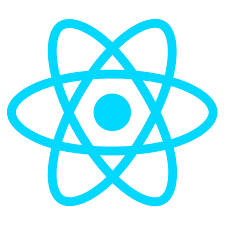
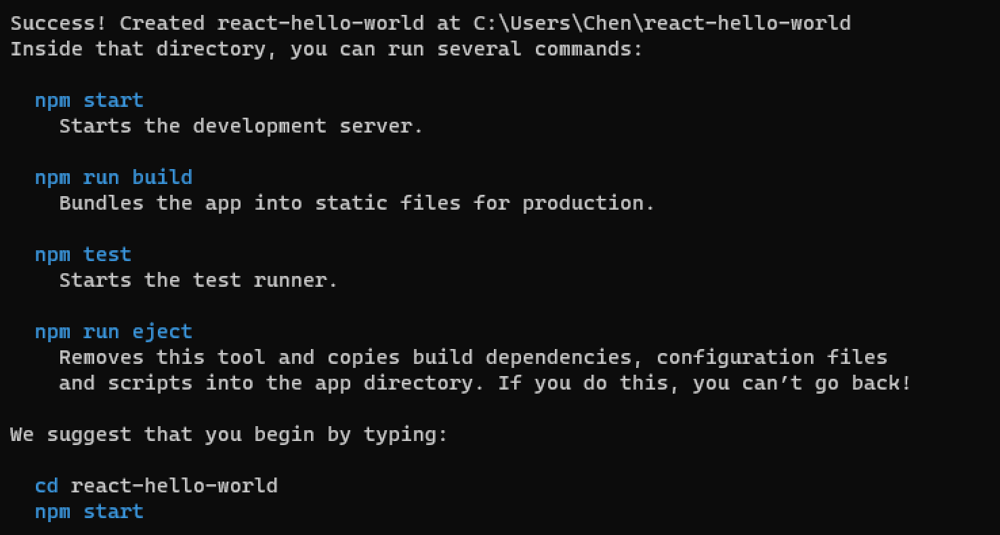
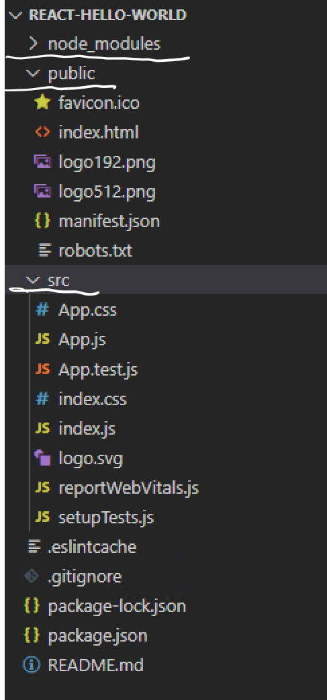
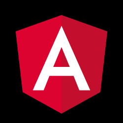
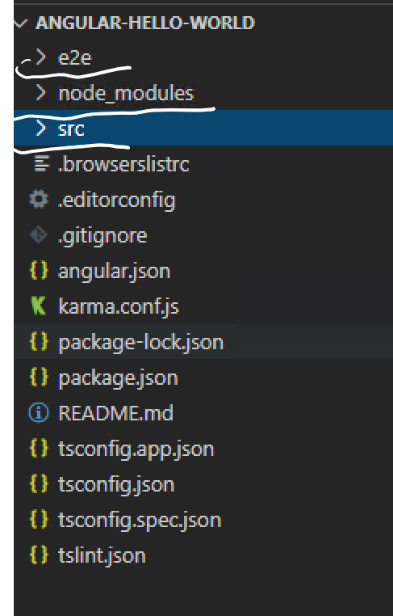

# Networking Basics

## How computers talk to each other

## Hardware
    * Eithernet
        * Eithernet Card
        * Cable
    
    * Wifi
        * Wifi Card
        * Wifi Router


## Network : TCP/IP (Transmission Protocol)

| Computer Network | vs | Telephone Network |
|:-- |:--:| -----:|
| Eithernet Card |  | Telephone |
| Cable |  | Cable |
| IP |  | Phone Number |
| Application Protocol: HTTP, SSH |  | Speaking Language: English, Chinese, Japanese |
| Port |  | press '1' For English, '2' for Chinese |

## Software/Application
    * What you can do with others/What your computer can do with other computers
    * Some business/activities  
        * Order / amazon
        * Fun / game

## Application Protocol
* Common Ports/Protocol (Application Protocol)

    | Port | Protocol |
    | -- | -- |
    | 80 | HTTP |
    | 443 | HTTPS |
    | 21 | FTP |
    | 22 | SSH |
    | 23 | TELNET |

* Customized

    | Port | Protocol |
    | -- | -- |
    | 3389 | RDP |
    | 3306 | MySQL |

* **1 IP:Port can only have 1 application listen on it**
This is the common reason why your server or debug does not start.    


# NodeJs and npm
## NodeJs
* From Wiki:

    > Node.js is an open-source, cross-platform, back-end, JavaScript runtime environment that executes JavaScript code outside a web browser. 

## npm
* From Wiki:
    > npm (originally short for Node Package Manager) is a package manager for the JavaScript programming language.

* Package: pack code and share it

## Create a nodeJs project
```
mkdir demo
cd demo
npm init
```
* it create a package.json for you.
    * windows
    ```
    dir
    ```
    * mac/linux
    ```
    ls
    ```
### **About package.json**
```javascript
{
  "name": "helloworld",
  "version": "1.0.0",
  "description": "My first nodejs project",
  "main": "index.js",
  "scripts": {
    "test": "echo \"Error: no test specified\" && exit 1"
  },
  "author": "",
  "license": "ISC"
}
```
### **index.js**
```javascript
const http = require('http');

const hostname = '127.0.0.1';
const port = 3000;

const server = http.createServer((req, res) => {
  res.statusCode = 200;
  res.setHeader('Content-Type', 'text/plain');
  res.end('Hello World');
});

server.listen(port, hostname, () => {
  console.log(`Server running at http://${hostname}:${port}/`);
});
```
### **run your application**
```
node indexjs
```

### **use npm to run your application**
Edit `package.json`, add the following under `scripts`
```javascript
...
"scripts": {
    ...
    "start": "node index.js" //add this line
    ...
}
...
```

### **debug demo** 
* set break point
* use tool buttons
* variables/watch

### **add packages/dependencies to your project**
* reuse other people's code
* where to find package? https://www.npmjs.com/, search there
* https://www.npmjs.com/package/shortid
* edit package.json
```javascript
"dependencies": {
    "shortid": "2.2.16"
  },
```
* run the following command under your project folder:
```
npm install
```
* where does the dependencies installed? `node_modules`

* use `shortid` on your `index.js`
```
const shortid = require('shortid');
...
...
res.end(`Hello World: ${shortid.generate()}`);
```


# React


## React https://reactjs.org/
* Web development
### **Install create-react-app**
```
npm install -g create-react-app
```

### **Create the react project**
* the command will create the project folder for you. 
```
npx create-react-app react-hello-world
```
* this will take some time



* run it
```
cd react-hello-world
npm start
```

### **the package.json**
* depnedencies
* scripts

### **Project structure**

* node_modules: nodeJs dependency packages
* public: non source code resources, pictures icons, static pages...
* src: source code folder

### **Add your code**
...

# Angular


## Angular https://angular.io/

### **Install the Angular CLI**
```
npm install -g @angular/cli
```

### **Create project**
```
ng new angular-hello-world
```

* run it
```
cd angular-hello-world
npm start
```

### **the package.json**
* depnedencies
* scripts

### **Project structure**


### **Add your code**
...

