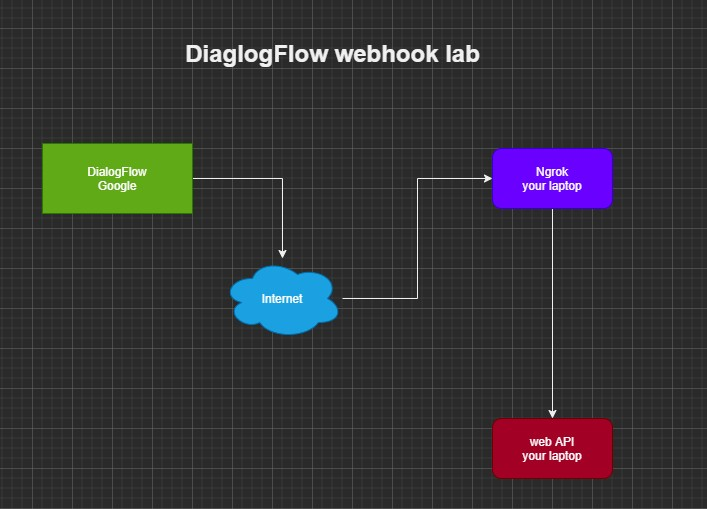

## Install NodeJs
https://nodejs.org/en/download/

## Intall ngrok
https://dashboard.ngrok.com/get-started/setup

## Install Visual Studio Code

https://code.visualstudio.com/download

## Install Postman

https://www.postman.com/downloads/

## Download following files from this folder 
index.js  
package.json  
https://github.com/STEMEduX/2020-2021Semester1/tree/master/Saturday/webhook

## run following command 
```
npm install
npm start
```
## system architect

